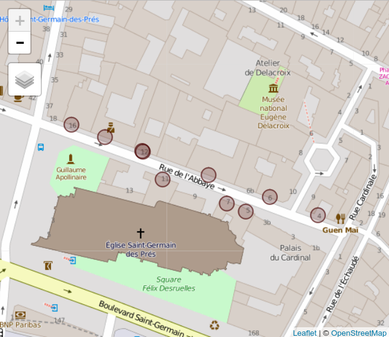

<!-- README.md is generated from README.Rmd. Please edit that file -->

```{r, echo = FALSE}
knitr::opts_chunk$set(
  collapse = TRUE,
  comment = "#>",
  fig.path = "README-"
)
```

# An R client for the BAN API

The `banR` package is a light R client for the [BAN API](https://adresse.data.gouv.fr/api/). The [Base Adresse Nationale (BAN)](https://adresse.data.gouv.fr/) is an open database of French adresses, produced by OpenStreetMap, La Poste, the IGN and Etalab. 

`banR` is not yet on CRAN, so for the time being it can be installed through `devtools`:

```{r eval=FALSE}
# install.packages("devtools")
devtools::install_github("joelgombin/banR")
```


`banR` allows to geocode lots of adresses in batch (the only hard limit is that, at the moment, the API only allows CSV files up to 8 MB). Please be gentle with the server though!

`banR` is designed to be used in a data exploration workflow, with a syntax 'à la `dplyr`':

```{r}
library(dplyr)
library(banR)
data("paris2012")

paris2012 %>%
  slice(1:10) %>%
  mutate(adresse = paste(numero, voie, nom),
         code_insee = paste0("751", arrondissement)) %>% 
  ban_search(adresse, code_insee = "code_insee") %>% 
  glimpse
```

After geocoding, it's a good practice to check if the results are consistent by mapping them on a base map. This can be easily done using the `mapview` package, for example. 

```{r leaflet}
paris2012_geocoded <- paris2012 %>%
  slice(1:10) %>% 
  mutate(adresse = paste(numero, voie, nom),
         code_insee = paste0("751", arrondissement)) %>% 
  ban_search(adresse, code_insee = "code_insee")

library(mapview)
library(sp)
paris2012_geocoded %>%
  as.data.frame %>% 
  SpatialPointsDataFrame(.[,c("longitude", "latitude")], ., proj4string = CRS("+init=epsg:4326")) %>% 
  mapView()
```

```{r, echo = FALSE}

```


Please report issues and suggestions to the [issues tracker](https://github.com/joelgombin/banR/issues).
